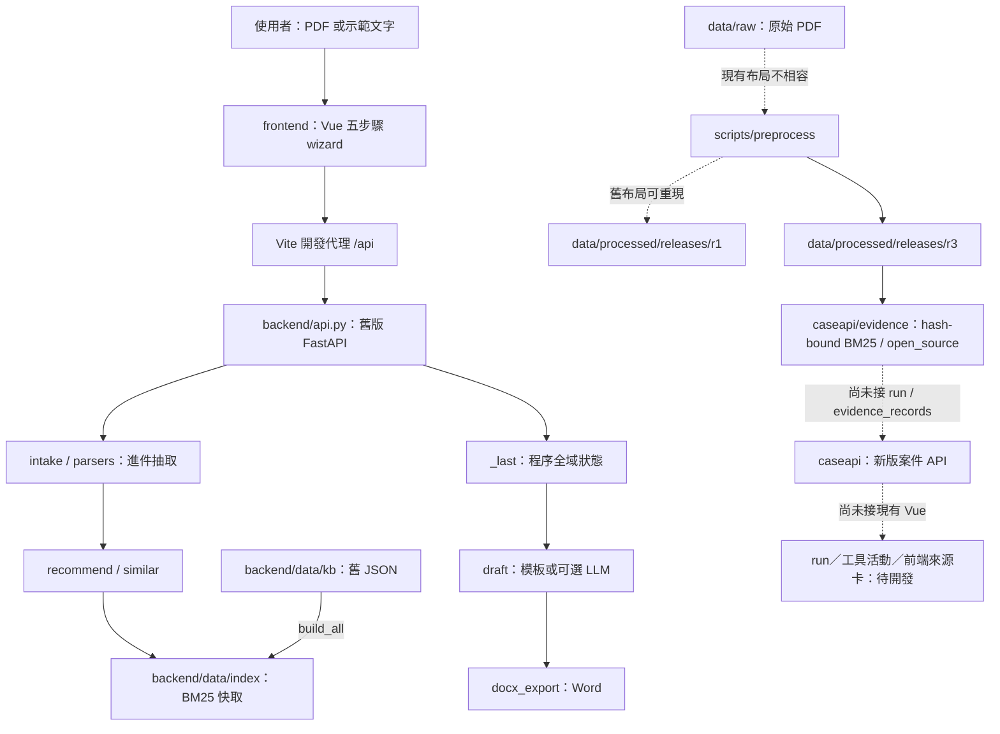

# 系統文件：訴願案 AI 輔助處理系統

盤點日期：2026-09-12｜範圍：目前 repo 的程式、資料、設計文件與本機流程｜狀態：盤點完成；階段 A 與 B0 證據層已獲授權實作。

本文件描述**目前已存在且經查核的系統**。下一階段目標依 [協作設計](../docs/協作設計/README.md)；逐項測試證據見 [驗證報告](驗證報告.md)。

2026-09-12：舊後端目錄由 `app/` 更名為 `backend/`，內容未變；`verification/*.json` 保留更名前的路徑作為證據。

2026-09-12 後續：使用者授權實作協作設計，新後端在 `backend/caseapi/`，與舊 `backend/api.py` 並存。階段 A、B0 證據底座與 B1 run／事件持久化已完成；後端 77 項測試通過，`caseapi` 覆蓋率 94%。r3 release 通過 15／15 檢查；`EvidenceRepository` 已能做 hash-bound 離線 BM25，`ai_runs`／`jobs`／`run_events` 已能凍結 context、持久事件、JSON replay 與冪等取消。逐案狀態與未完成項見 [協作設計 05 §6](../docs/協作設計/05-實作順序與驗收.md)。現有 Vue 仍未接新版 API。

## 1. 判斷與工作邊界

目前有一套可執行的 Vue 前端與舊版 FastAPI／BM25／模板草稿流程；另有新版案件 API、r3 前處理產物與獨立 EvidenceRepository。**新證據層尚未接進 run／`evidence_records`／前端來源卡，現有 Vue 仍走舊資料路徑。**

| 問題 | 盤點結論 |
|---|---|
| 前端能不能跑？ | 能。type check、build、lint 通過；瀏覽器走完示範解析→程序頁→依據頁→草稿→Word API。沒有前端單元測試，未驗證所有畫面／邊界情況。 |
| `backend/` 能刪嗎？ | 不能整包刪。它仍提供前端所需的分析、檢索、草稿及匯出 API。本次只刪除兩套已退役 demo UI。 |
| r1 是不是做完？ | r1 是可重現但未簽收的歷史產物；r2 修了多項契約缺口；r3 再修正法規閱讀順序，可供機械證據層使用。三者都不是法律覆核收據，評估 gold 仍未完成。見 §3.3a／§3.3b。 |
| 下一步只有 RAG、LLM、API 嗎？ | 案件 API、BM25 證據底座與 run／事件持久化已有實作；下一步是 Evidence 工具 adapter，再用固定假模型完成端到端。線上模型已排入後續授權順序；向量仍須先有 BM25 評估不足的證據。 |
| 這輪是否繼續開發？ | 已在使用者授權後完成階段 A 與 B0；未新增線上 LLM、embedding、run／SSE、登入或前端整合。 |

## 2. 目前程式架構



### 2.1 現役前端

技術來源以 [package.json](../frontend/package.json)、[Vite 設定](../frontend/vite.config.ts) 為準。`router/index.ts` 只有 `/`，五步驟由 [case store](../frontend/src/stores/case.ts) 控制。

| 頁面 | 已存在的行為 | 實際限制 |
|---|---|---|
| Upload | 必要 PDF＋選填原處分 PDF；3 個文字示範；LLM 開關 | 其他附件只是展示說明。示範文本不是評估 gold。 |
| Extract | 顯示後端抽取欄位、摘要、推薦關鍵字 | 沒有欄位修正或逐頁／行 EvidenceRef；「AI 擷取」「有出處」是 UI 標籤，不能作為來源驗證。 |
| Gate | 八款人工點選狀態、舊時效提示 | 沒有 `gate.py`／完整期間引擎；狀態未送後端、未持久化。第 3／8 款固定待人工，第 5 款文案與可操作行為不一致。 |
| Select | 法條、函釋／判解、前例列表與勾選；原文連結 | 勾選只留前端。對「草稿只引用勾選內容」的承諾尚未實現。 |
| Draft | 模板／可選 LLM 草稿；三個文字區可改；Word 匯出 | 沒有版本、diff、採用、撤回、稽核；重新生成可重置人工內容。 |

前端對應 [design 稿件表](../docs/design/README.md)，但這不等於完成新 [協作設計](../docs/協作設計/README.md)。目前可見的日期、法律結論與提示仍需業務驗收，本次只判斷程式行為。

### 2.2 舊 API 與狀態

[client.ts](../frontend/src/api/client.ts) 呼叫 [api.py](../backend/api.py)：

| 端點 | 用途 | 本次狀態 |
|---|---|---|
| `GET /api/health` | SDK 可用旗標與存活回應 | PASS；不驗證索引完整性或模型可成功呼叫 |
| `POST /api/analyze` | multipart／form：`pdf`、`manual`、`text` | PASS；回傳欄位、6 法條、3 見解、5 前例等舊格式 |
| `POST /api/draft` | 以最近一次分析生成草稿 | PASS（模板）；request 沒有案件 ID 或勾選依據 |
| `POST /api/draft/docx` | 以 `main/fact/reason` 匯出 Word | PASS；已讀回 DOCX XML 核對三欄修改值 |
| `GET /api/decision/{doc_id}` | 舊 KB 決定書全文 HTML | PASS；不是原 PDF 或 r1 座標查詢 |
| `GET /api/reference/{doc_id}` | 舊 KB 函釋／判解全文 HTML | PASS；同上 |
| `GET /` | API 入口 | 清理後 307 導向 `/docs` |

`_last` 是 Python 程序全域 dict。分析、草稿、匯出共享最近一案；兩個使用者／分頁會互相覆蓋，多 worker 也不共享一致狀態。這是程式結構已確認的限制；本次沒有把它修成案件服務，也未執行負載／多人競爭測試。

舊 `api.py` 沒有 SQLite、case revision、Proposal、EvidenceRef 或 SSE run events。新版 `caseapi` 已有 `/api/v1`、SQLite、不可變版本、Proposal／EvidenceRef 與三方採用，但尚無 run／SSE。舊 API 的 `doc_id` 仍與 release 的 `document_id/section_id/chunk_id` 不相容，未交付遷移映射。

### 2.3 檢索與模型

- [retrieval.py](../backend/src/retrieval.py) 讀取本地 pickle 中的 documents／texts，再建立 BM25。若存在 `.npy` 且 Provider 可用，才加入 query embedding。
- 本機索引是 `statutes.pkl`、`decisions.pkl`、`refs.pkl`，沒有向量檔。離線檢索與由舊 JSON 重建索引均實測通過。
- [recommend.py](../backend/src/recommend.py) 與 [similar.py](../backend/src/similar.py) 使用舊資料、條號與加權規則；不是新前處理 release 的檢索器。
- [providers.py](../backend/src/providers.py) 仍有舊 Gemini SDK／模型設定。**線上 LLM、embedding、額度與模型名稱可用性均 NOT RUN**；本次將兩個 API key 環境變數設空。
- 「本地原文被檢索出來」只證明來源存在，不能證明它支持本件法律結論；本次沒有評估檢索命中率或法律準確度。
- [EvidenceRepository](../backend/caseapi/evidence/repository.py) 是分離的新路徑：啟動時驗 r3 manifest 與四個必要 artifact hash，只索引 3,002 個 eligible chunks，支援文件類型過濾、同案家族排除與來源 quote 重建。它尚未接到 API run 或提案證據紀錄。

## 3. 資料流程與 release 判定

### 3.1 三種資料不要混用

| 層次 | 路徑 | 規模／用途 |
|---|---|---|
| 原件 | `data/raw/` | 153 PDF、755 頁：141 份語料（731 頁）＋12 份進件文件（24 頁） |
| 舊 runtime 語料 | `backend/data/kb/` | 法條 1,976、歷史案件 101、函釋 10、判解 19；現役 API 依賴它的索引 |
| 歷史前處理產物 | `data/processed/releases/r1/`、`r2/` | r1 是原稽核主體；r2 是修復多項契約缺口但誤判四法規根因的中間產物 |
| 現行機械基線 | `data/processed/releases/r3/` | 141 documents、731 pages、2,627 sections、3,103 chunks；3,002 個准入，見 §3.3b |

153 個 Git 舊路徑的刪除與 `data/raw/` 新增，在本次開始前已存在。逐個對照 HEAD 原件，**153／153 的位元組完全一致**。本次沒有重做搬家、恢復舊路徑或提交這些變更。141 份 r1 來源都可用 SHA-256 找到搬家後原件，對照見 [source-relocation.json](verification/source-relocation.json)。

### 3.2 已驗證可保留的部分

- 所有 document／section／chunk 主鍵及既有結構檢查在原驗證器中通過。
- 本次另全查 2,623 個 section：span 範圍合法，quote 100% 可重建；非空白原文字元沒有未歸屬的遺失。
- 在暫存目錄重建原 `data/<分類>/` 布局，使用既有 **Python 3.9.6＋PyMuPDF 1.26.5**，完整跑兩次；8 個 JSONL 均與既有 r1 的 SHA-256 完全相同。
- 因此 r1 可以作為修復與再驗收的起點；不必因發現缺口就全部丟掉重做。

### 3.3 阻擋簽收的缺口

| 缺口 | 已確認的證據 | 對下一步的影響 |
|---|---|---|
| 原件路徑失效 | `documents.source_file` 141／141 指向搬家前路徑 | 原文查回 loader 會找不到檔；需新 release 或明確來源解析契約 |
| 現目錄無法重跑 | `--input data/raw` 讀到 153 PDF，分類全落未知，section／chunk 都為 0，exit 1 | 需修正分類／輸入基準；12 份進件不能無差別當語料 |
| chunk 引用不精確 | 623／3,106 個 quote 與其 spans 重建全文不同 | 不能把這些 spans 當精確引文定位；目前沿用整個 section 範圍 |
| 契約不完整 | 3,106 chunks 都缺 `chunking_version`；未交付完整 JSON Schema／Pydantic schema | loader 邊界與版本驗證尚未成立 |
| 法規 metadata 不完整 | 2,214 個法條 section 缺 `law_id`、`paragraph_path`、`source_version_id` 等多個規格欄位 | 2,214 是 parser 輸出數，並非人工認證的正確條文總數 |
| 發布清冊不足 | manifest 無設定／產物 hash 與完整成功／失敗／隔離帳 | 舊 `validated` 不足以證明可發布；本次旁錄 hash 不會補成原交付通過 |
| 關鍵標籤尚未完成 | 101 annotations 只抽案號、文號、日期、訴願人、機關；505 個欄位全 `unreviewed` | 未完成正文類型、結果、款別覆核，不能作 gold 或硬過濾 |
| 未決來源／人工覆核 | 675 引用全 `unresolved`、target 全空；7 低文字頁待處理，21 個 eligible chunks 觸及這些頁 | 未驗證不得冒充已 resolved／已覆核；需完成實際定位與准入判定 |
| 評估隔離缺失 | 101 決定書 `case_family_id` 全空；`data/evaluation/` 不存在 | 尚不能做符合規格的 dev／holdout 評估或防同案答案洩漏 |

本次詳細計數在 [r1-audit.json](verification/r1-audit.json)。這份報告是技術契約稽核，不是法律覆核收據。r1 內的 manifest／QA 保留原樣；使用時以本次「尚未簽收」判定補充舊標籤，避免改寫歷史證據。

### 3.3a 2026-09-12（同日）r2：修復多項缺口，仍非法律覆核收據

使用者同日要求重做前處理。**沒有覆寫或修改 r1**；r2 是 `data/processed/releases/r2/` 下的獨立新 release，同一批 141 份原件、由 `scripts/preprocess/` 重新產出。

已修復：來源路徑可解析（`--input data/raw` 已能正確判別四類語料並排除 12 份進件文件）、全部 2,834 個 chunk 的 quote 可由 source_spans 100% 重建（改用逐字元 offset 對應原行，取代 r1 整段沿用 section spans 的作法）、`chunking_version` 齊全、manifest 新增 `config_hash` 與每個產物檔案的 sha256、101 件決定書皆有 `case_family_id`（依正文抽出的案號分組）、675 個引用中 227 個已解析出庫內 `target_id`、連續兩次重跑的產物 hash 完全相同。

**以下是 r2 當時的判讀，已由 §3.3b 的 r3 證據推翻，不能再當現況使用。** 當時把訴願法、行政程序法、洗錢防制法、行政院及各級行政機關訴願審議委員會審議規則這 4 部法規判成全國法規資料庫「逐頁瀏覽」格式匯出：每頁開頭像是重複跳頁小工具，r1 因而產生大量空內容或錯誤合併的條文；r2 排除連續條號後，改以章／節粒度保留全文，並認為要重新取得「顯示所有條文」匯出檔才能修復。r3 後來證明 PDF 本身已有完整條號與正文，真正問題是 block 閱讀順序。

**仍未完成，不能視為法律覆核通過**：101 件決定書的案件類型／主文結果為規則式抽取（`review_status: unreviewed`）；11 部法規條號未逐條人工核對（本次僅 6 份文件定向抽查，遠低於規格要求的 20 份）；`data/evaluation/v1/splits.json` 只完成 dev／holdout 家族分組，未產生規格 §7.2 要求的合成輸入與 gold；未接入向量化或線上 LLM／embedding，全程離線。

詳細計數、修復對照表與抽查結果在 [r2-audit.json](verification/r2-audit.json)。這份檔案保留當時的判斷作為歷史證據；下節 r3 已更正四法規根因。r1 的 manifest／QA／`r1-audit.json` 均未被本節動作修改，保留供對照。

### 3.3b 2026-09-12（同日）r3：法規閱讀順序根因更正與證據底座

r2 把四份法規 PDF 判為「逐頁瀏覽小工具、正文沒有可信條文標題」，並建議重新取得其他匯出格式。後續逐頁渲染與 PyMuPDF bbox 檢查證明這個根因不成立：本地 PDF 已是可見完整條號與正文的「所有條文」版面，只是 PDF 內部 block 原順序先列左欄條號，再列右欄標頭／正文。這是抽取器閱讀順序問題，不是來源缺資料。

r3 保持 141 份原件位元組不變，將 extraction version 升為 `ext-2.0`；法規頁面依 y 位置分列、同列依 x 位置排序，其他文件維持原順序。r3 的機械結果：

- 141 documents、731 pages、2,627 sections、3,103 chunks；3,002 eligible，101 個歷史主文 chunk 依 `historical_outcome_excluded` 排除。
- 2,214 個 `statute_article`，0 個無法解析 `article_key`，0 個章節退場報告；附加條號 section 238 個。
- 675 個引用中 588 個解析到同 release 的法規條文；其餘 87 個是 corpus 未收錄法規，不臆造 target。
- release validator 15／15 PASS；3,103 個 chunk 的 quote 全量可從 page／line／char spans 重建。
- 最終 r3 與兩次獨立暫存重跑的 9 個 JSONL 產物 hash 全部一致。四份法規各自的版面回歸 4／4 PASS，並逐一渲染第 1 頁做視覺確認。

新版 `EvidenceRepository` 會先核對 r3 release ID、`publish_status` 與必要 artifact hash，再建記憶體 BM25；搜尋會去重並可排除同案件家族，`open_source` 重新核對 quote 後才回傳來源 hash，時效狀態固定為 `snapshot_only`。實測查詢訴願 30 日期間時，Top 1 是《訴願法》第 14 條，原文定位與 quote 均相符。

這仍只是**機械資料契約與檢索底座通過**，不是法律覆核：101 件決定書類型／主文結果仍為 `unreviewed`；11 部法規未完成逐條人工核對；7 個低文字頁待判定；法規生效期間 metadata 留白；評估包沒有 §7.2 合成 inputs／gold，未量 BM25 Recall@5；也沒有線上 LLM／embedding。詳細證據、hash 與限制見 [r3-audit.json](verification/r3-audit.json)。

### 3.4 重現性與環境差異

在 backend 的 Python 3.12.14＋PyMuPDF 1.24.9 環境，兩次重跑彼此相同，但得到 **3,108 chunks**；pages、sections、chunks、citations 的 hash 與 r1 不同。原前處理環境得到 3,106 chunks 且逐檔相符。

這是已驗證的**環境組合差異**；本次沒有單獨控制每一個變因，因此不將全部差異歸因於單一套件。應保留完整版本資訊；更新抽取器需新 extraction version、重建與重新驗收。

## 4. 執行與環境

### 4.1 本機已存在的環境

| 用途 | 路徑 | 本次版本 | 保存方式 |
|---|---|---|---|
| 前端 | `frontend/node_modules/` | Node 26.5.0、npm 11.17.0；Vue 等版本依 lock | 已由錯置的 `app/frontend/` 歸位；忽略版控 |
| 舊 API | `backend/.venv/` | Python 3.12.14、PyMuPDF 1.24.9 | 依 `backend/requirements.txt`；忽略版控 |
| release 重現 | `.venv_pre/` | Python 3.9.6、PyMuPDF 1.26.5 | 本機保留；同環境重現 r1/r2/r3，版本記於獨立 requirements |

既有套件已足以完成本次驗證，沒有安裝、升級或啟用新服務。全新環境安裝與跨平台部署均未驗證。

### 4.2 啟動與檢查

從 repo 根目錄，兩個終端機分別執行：

```bash
cd backend
GEMINI_API_KEY='' GOOGLE_API_KEY='' .venv/bin/python -m uvicorn api:app --host 127.0.0.1 --port 8000
```

```bash
cd frontend
npm run dev -- --host 127.0.0.1 --port 5173 --strictPort
```

開啟 `http://127.0.0.1:5173`。保持兩個 key 為空，才是這次已驗證的離線 BM25＋模板模式。API 根頁面現在導向 Swagger `/docs`。

本次 8000／5173 已有其他服務，因此另開 18000／15173，透過 Vite `createServer()` 僅在測試程序中覆寫 proxy 至 `127.0.0.1:18000`。沒有更改正式 Vite 設定，也沒有終止原有服務。

可重跑的現有檢查：

```bash
# repo 根目錄
backend/.venv/bin/python -m tests.preprocess.test_regression
.venv_pre/bin/python -m tests.preprocess.test_statute_layout
.venv_pre/bin/python -m scripts.preprocess.run validate --release r3

# backend/
.venv/bin/python -m pytest

# frontend/
npm run build
./node_modules/.bin/oxlint .
./node_modules/.bin/eslint .
npm run test:unit -- --run  # 沒有測試檔，預期 exit 1，不是 PASS

# backend/
GEMINI_API_KEY='' GOOGLE_API_KEY='' .venv/bin/python -m src.demo_retrieval
```

若缺舊索引，在 `backend/` 執行明確的離線函式入口：

```bash
GEMINI_API_KEY='' GOOGLE_API_KEY='' .venv/bin/python -c 'from src.build_index import build_all; build_all(use_vector=False)'
```

不要以 `python -m src.build_kb` 或 `python -m scripts.preprocess.run all` 當一般啟動指令。前者預設來源位置失效且可能覆寫空 KB；後者預設寫入 r1，當前布局也不相容。

### 4.3 乾淨環境與設定

未具備本機環境時，需另行準備 backend Python 3.12 venv 並依 `backend/requirements.txt` 安裝；frontend 依 `package-lock.json` 使用 `npm ci`，再離線重建舊索引。這是部署準備說明，**本次未執行乾淨安裝，也未保證過去舊套件在所有環境仍可安裝**。

前處理應使用獨立環境及 `scripts/preprocess/requirements.txt`，不能直接在 backend venv 升降 PyMuPDF。本次保留了能重現的原環境，新的 Python／平台組合仍需驗證。

機密只放程序環境或本機 env 檔，不寫入報告、不提交。正式站台的 `/api` 代理、使用者驗證、持久化、並行與備份都不在本次完成範圍。

## 5. 整理後的文件與刪除邊界

```text
README.md                     專案入口與最快啟動方式
AGENTS.md / CLAUDE.md          repo 工作規則；CLAUDE 指回共同規則
sysdoc/
  README.md                   本文件：實作現況與交接
  驗證報告.md                 本輪 PASS／FAIL／NOT RUN
  verification/               日誌、計數、hash、來源搬家對照、UI 讀回
docs/
  README.md                   文件用途與優先順序
  design/                     原始設計稿＋元件對照
  協作設計/                   下一階段五份設計與 README
  Reference/                  法律／資料背景、UI 討論、官方命題 PDF
  資料前處理與切分交接規格.md  資料交付契約
  北極星指南手冊.md           整體方向與需求背景
data/README.md                原件、release 與使用狀態
backend/README.md             舊版後端範圍與安全啟動
frontend/README.md            現役前端操作與限制
scripts/preprocess/README.md  前處理版本、重現限制與入口
```

本次刪除 `app/app.py`、`app/web/index.html`、`app/web/app.js`、`app/web/style.css`（當時目錄名為 `app/`）；同步移除 API 的舊靜態頁掛載並讓 `/` 導向 `/docs`。移除僅供退休 UI 或沒有程式引用的 `streamlit`／`scikit-learn` 直接依賴宣告，沒有卸載現有環境。

`app/frontend/` 原本沒有另一份前端程式，只有套件、lint cache、編輯器設定。套件與設定移到現役 `frontend/`，cache 刪除後移除空殼目錄。另刪 macOS `.DS_Store` 與部分 Python cache；`.venv_pre/` 只取消追蹤，實體保留。

既有設計、命題與法律來源仍有用途，全部保留；以索引與優先順序整理，不建立平行的第二套規格。原件、r1、舊 KB／有效索引也保留。詳細操作記於 [cleanup-actions.json](verification/cleanup-actions.json)。

未建立 commit、PR 或部署；`.venv_pre` 的 Git 索引移除是唯一預先 staged 的清理，其餘變更保留供 review。原先 153 個 PDF 搬家變動仍未替使用者提交。

## 6. 後續交接順序

本節描述依賴關係；完成狀態以 [協作設計 05 §6](../docs/協作設計/05-實作順序與驗收.md) 為準。尚未列為完成的工作仍需使用者授權。

1. **資料與共同契約（部分完成）。** r3 已修復 raw 分類、精確 chunk spans、版本、案件家族與發布驗證；仍要補法律人工覆核、低文字頁處置及評估 inputs／gold。
2. **最小案件狀態與 API（階段 A 完成）。** `case_id`、revision、EvidenceRef、TargetRef、Proposal、SQLite、衝突與採用鏈已有測試；真登入、規則引擎、送審與前端整合仍未完成。
3. **可驗證檢索與 run 基底（B0/B1 完成）。** r3 read／search／open、BM25、同案排除、run context、持久事件、JSON replay 與取消已完成；下一步把 EvidenceRepository 包成會寫真實工具事件與 `evidence_records` 的 adapter。
4. **接固定假模型與線上模型（已授權、尚未完成）。** Evidence adapter 完成後先以固定假回應驗證 SSE、取消／重連與完整 run，再接線上 provider；之後建立 gold 量 BM25。不能把 3,103 chunks 無差別送去 embedding，目前只有 3,002 個准入，且加向量仍需評估證據。

每階段完成狀態應回寫 [協作設計的驗收表](../docs/協作設計/05-實作順序與驗收.md)，並以真實執行結果更新 sysdoc。未經端到端實跑的 A03、A04、A06、A08、S01、S02 維持 NOT RUN。
